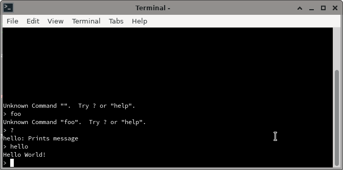

# pico_uart_console
This project provides an easy-to-integrate console for C-based PI PICO Projects.

To accommodate different usage scenarios, different console "modes" are provided:

  * `CONSOLE_MINIMAL`: Silently consumes characters.  Mostly intended for
  program API use (e.g. writing a python program that sends commands to the
  PICO)
  * `CONSOLE_ECHO`: Echos back characters for terminals that provide no
  editing support.
  * `CONSOLE_VT102`: When used with a capable terminal
  emulator, this mode provides rich editing features.  This includes cursor
  control, insert mode, command history, and tab completion.

  Here is a minimal example that uses the library:

```c
#include "pico/stdlib.h"
#include <stdio.h>
#include "uart_console/console.h"

static void hello_cmd(uint8_t argc, char* argv[]) {
  printf("Hello World!\n");
}

struct ConsoleCallback callbacks[] = {
    {"hello", "Prints message", 0, hello_cmd},
};

int main() {
  struct ConsoleConfig cc;
  uart_console_init(&cc, callbacks, 1, CONSOLE_VT102);

  while (1) {
    uart_console_poll(&cc, "> ");
    sleep_ms(20);
  }
  return 0;
}
```

and an example session (as found in [examples/minimal/main.c](examples/minimal/main.c)):



To build the `uart_console_minimal.uf2` binary that can be loaded on the PICO:

```bash
./bootstrap.sh
cd build/examples/minimal
make
```

Note that, by default, the console uses the USB version of the console.  To use
the serial connection instead change
[examples/minimal/CMakeLists.txt](examples/minimal/CMakeLists.txt):

```cmake
pico_enable_stdio_usb(uart_console_minimal 0)
pico_enable_stdio_uart(uart_console_minimal 1)
```

and rebuild the code.

Let's breakdown the example a bit, starting with the callback:

```c
static void hello_cmd(uint8_t argc, char* argv[]) {
  printf("Hello World!\n");
}
```

This looks a lot like a `main()` function in a C program.  It will be called
when the user enters the "hello" command.  For this case, `argc` will always be
`0` and `argv[]` will be empty.

Now on to the registration structure:

```c
struct ConsoleCallback callbacks[] = {
    {"hello", "Prints message", 0, hello_cmd},
};
```

Here we give the command name, a description string (for when the user enters
`help`), the number of expected arguments and the name of the defined callback
function.

> Note that an entry can use `-1` for the number of arguments to accept any
number.  In that case, the callback function will need to look at `argc` and
handle correct usage itself.

Next initilization:

```c
int main() {
  struct ConsoleConfig cc;
  uart_console_init(&cc, callbacks, 1, CONSOLE_VT102);
  ...
}
```

We need to create a `ConsoleConfig` structure to hold the state of the console.
We then initialize it will the defined callbacks, the number of callbacks (in
this case just `1`) and the type of console we we to use (called the `mode`),

> Note: The console mode can be changed at any time by changing the `mode` field
in `ConsoleConfig`.  Thus you might have a command to change it from
`CONSOLE_VT102` to `CONSOLE_MINIMAL` for program access.

Finally the polling function:

```c
int main() {
  ...
  while (1) {
    uart_console_poll(&cc, "> ");
    ...
  }
  ...
}
```

The polling function must be called regularly to give the user a responsive
experience and not miss data.

Any time that `uart_console_poll()` is called, it may invoke a
registered callback function before returning.  For this example,
that means that the `hello_cmd()` callback could get called as a result
of calling `uart_console_poll()`.

If this simple polling model is unworkable for your program, you could put all
of the command processing on CPU1 for better responsiveness but then callbacks
will also occur on CPU1.  You'll thus need a way to coordinate communications
between CPU1 and CPU0.  The Pico SDK provides locks, message queues and other
mechanisms for this purpose.

or, you can use the lowlevel API functions described below.

## Low Level API

For the sake of convienence, the default usage pattern uses `uart_console_init()` and `uart_console_poll()`.  While easy to use, these do have some limitations:

  1. You are locked into the `stdio` path.  If you wanted to direct characters
  to an attached LCD, this is not going to work out.

  2. You may want to use interrupts instead of polling.

  3. You may want to get input from something other than the UART/USB (such as connected hardware that is using SPI or I2C).

For all of these cases:

  1. If you want to feed input characters from a custom source, you can use `uart_console_putchar()`.

  2. If you want to output characters (prompt, help text) to a custom device,
  you can use `uart_console_init_lowlevel()`, which takes a `int (*putchar)(int
  c)` callback.  You can have this callback point to a custom function that handles
  the data in any way you would like (for example, sending it to an LCD).

  3. The options above are mix/match.  You can use either `uart_console_poll()` or
  `uart_console_putchar()` and match it up with either `uart_console_init()` or
  `uart_console_init_lowlevel()`.

  4. One caveat.  If you are using `uart_console_init_lowlevel()` with `uart_console_poll()`, you need to call `stdio_init_all()` yourself becuase `uart_console_init_lowlevel()` has no idea if you want that called or not.

  5. Another one.  Calling `uart_console_putchar()` directly from an interrupt
  handler is soething to think about cautiously because any registered callbacks
  and output produced would also be serviced by the interrupt.  In many cases,
  you'll want to have the interrupt handler buffer the characters somewhere and
  have the main thread feed this buffer to `uart_console_putchar()` when it can.
  This turns out to be pretty similar to what happens using the `stdio` route
  but you'll have control over the details.

